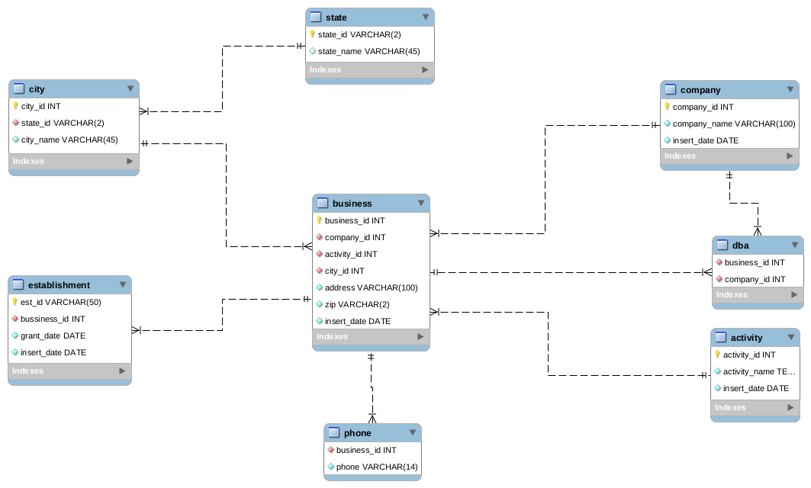

## Automated progress reporting and monitoring (Db modeling, cloud storage, data mining)

A firm which is a stake holder in the meat and poultry industry in the United States wants to create a database to serve as a foundation for monitoring the progress (additions and collapsing of companies). They seek a data engineer to do the following from data from US Gov data;
    <ol>
        <li>Design a normalized Database, first on the local machine and think of migrating it to aws</li>
        <li>Create pipelines using spark, airflow and where possible dbt for the update and visualization of the industry progress</li>
        <li>Create alert and prompts using aws</li>
        <li>Save reports on aws</li>
    </ol>

## Solutions (Work in progress)
### Designed model

